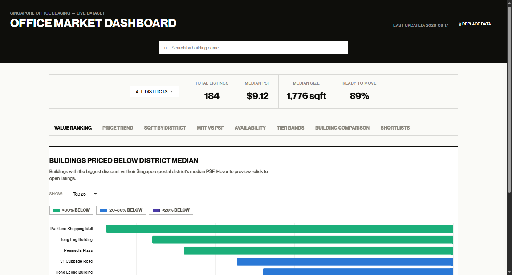
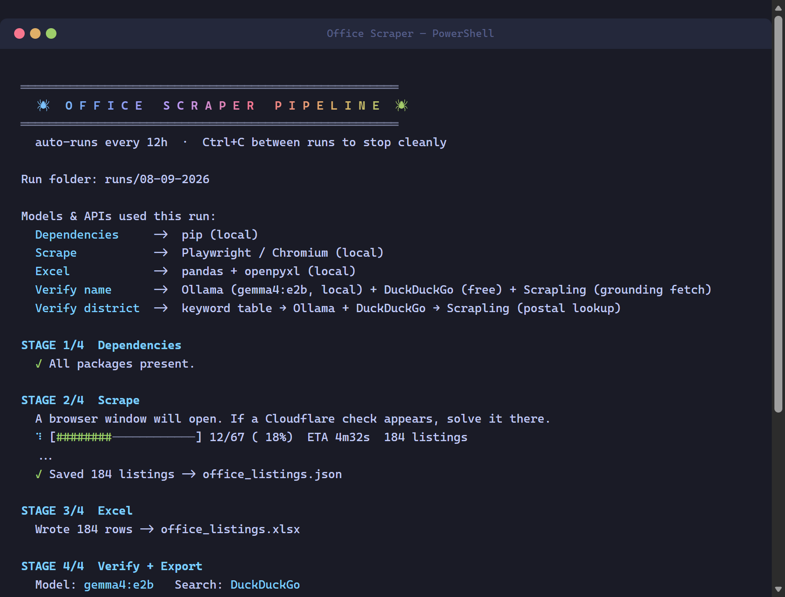
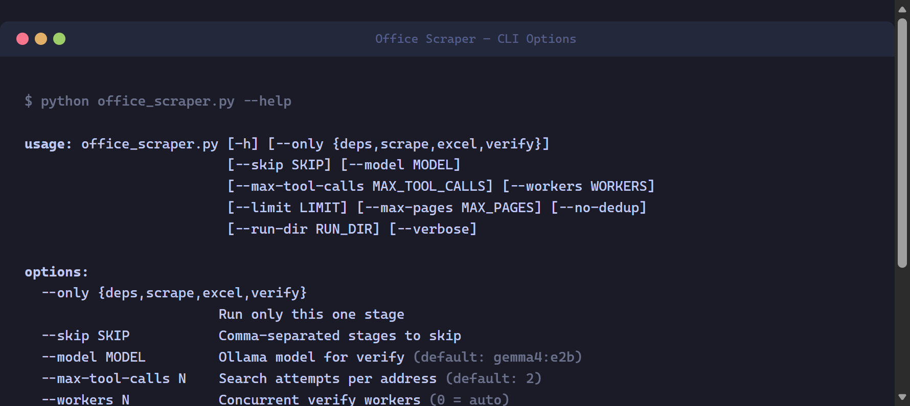
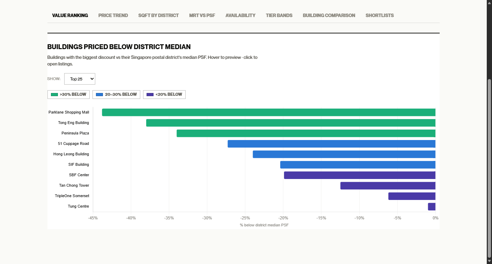
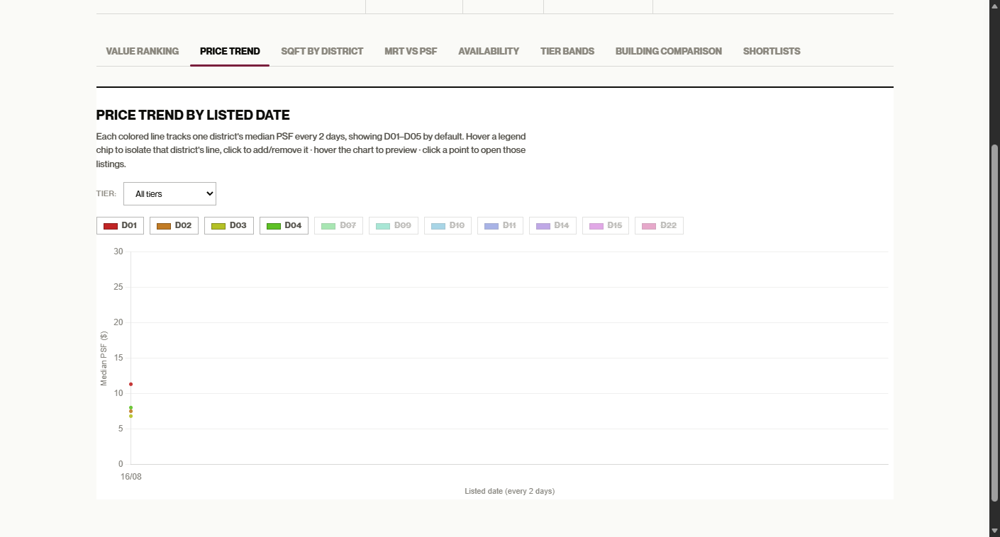
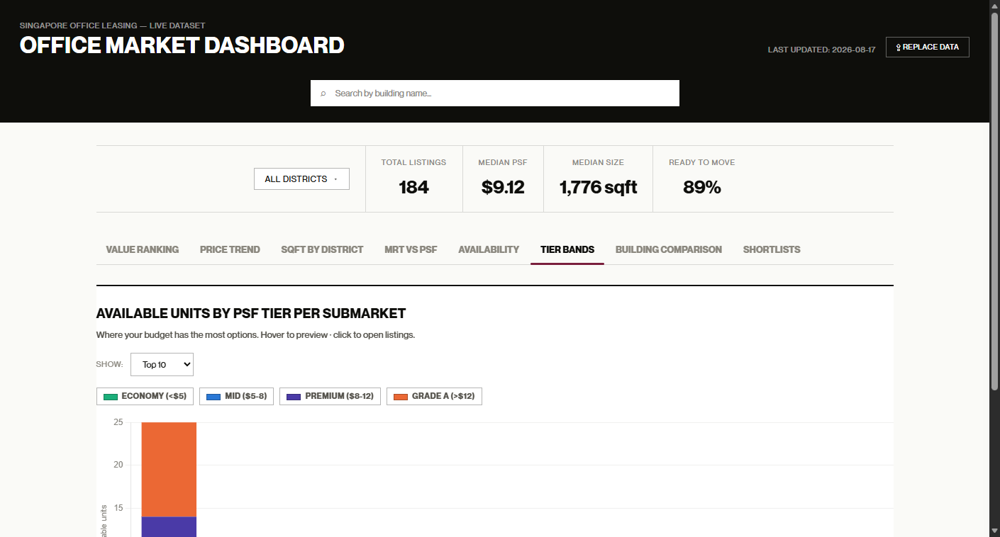
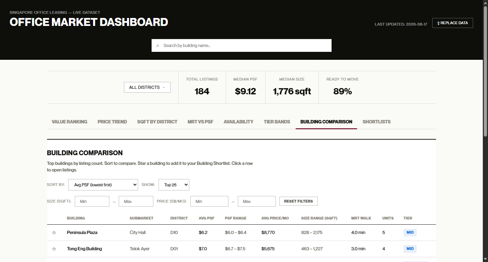

# Office Scraper

An automated pipeline that scrapes Singapore commercial office rental listings, verifies building names against real-world addresses using a **local LLM with web-search tool calling**, resolves postal districts, and publishes styled Excel workbooks plus a self-contained interactive analytics dashboard. Runs continuously on a 12-hour cycle.

> **Note:** This is a portfolio showcase. The source code lives in a private repository.

## What it does

- **Scrapes** office-for-rent listings (name, address, price, PSF, size, availability, agent, MRT distance, listing date) with two-layer deduplication, exact URL plus an address+size+type fingerprint that folds duplicate listings into an "also listed by" field
- **Verifies** every building name with a locally-hosted LLM: the model calls a `search_web` tool, and a grounding check rejects any "corrected" name unless the name and address actually co-occur in a search result or fetched page, no hallucinated corrections
- **Resolves districts** through a three-tier fallback: local keyword table → LLM → postal-code sector lookup
- **Publishes** styled XLSX workbooks (raw + verified) and a dashboard with KPI tiles, value ranking, price trends, tier bands, building comparison and persistent shortlists

## Tech & architecture

- **Python 3.10+** single-pipeline design: Playwright (async Chromium) with hand-rolled stealth for scraping, BeautifulSoup for parsing, pandas + openpyxl for Excel output
- **Local LLM via Ollama** (tool-calling), with Brave Search API or DuckDuckGo as the search backend; verification runs on a thread pool with checkpointing every 5 addresses, so an interrupted run resumes where it left off
- **Zero-infrastructure dashboard**: one self-contained HTML file (embedded fonts, inlined Chart.js, five canvas charts) that reads a `data.json` produced by the pipeline; shortlists persist in `localStorage`. No server-side components, no database
- **Self-managing**: the pipeline checks and installs its own dependencies (including the Playwright browser) on first run, and each run's outputs land in a dated `runs/` folder

## How it works

Four stages run in sequence: **deps → scrape → excel → verify**, then the pipeline sleeps 12 hours and repeats. Any stage can be run or skipped individually (`--only scrape`, `--skip verify`), with flags for page limits, worker counts and model selection for quick test runs.

The verify stage is the interesting part: for each unique address, the LLM is prompted with the scraped building name, allowed up to two web-search tool calls, and its answer is only accepted if grounded in retrieved evidence. This turns a noisy listings site into a dataset clean enough to chart PSF pricing by district and building tier.

## Screenshots

**Pipeline running**

**CLI options**

**Value ranking**: best PSF value by building

**Price trend**

**Tier bands**: PSF distribution by building tier

**Building comparison**

